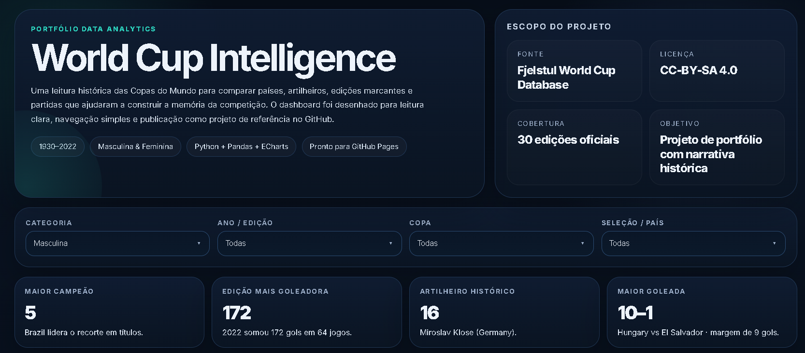
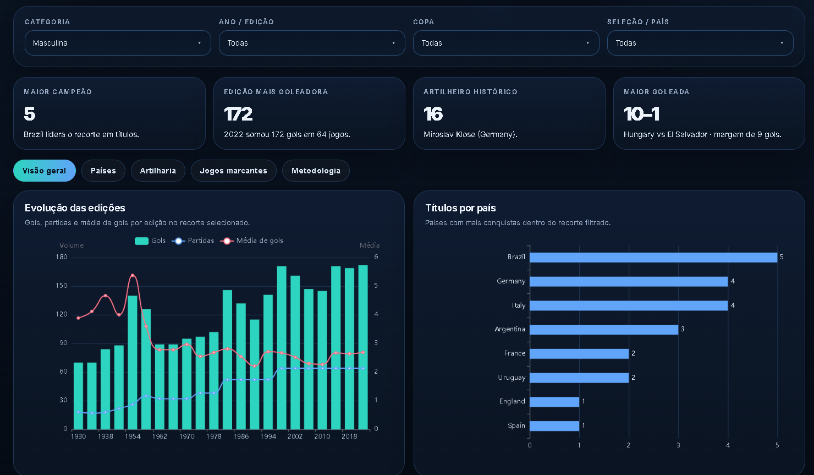

# World Cup Intelligence

Dashboard interativo publicado na web com foco em análise histórica das Copas do Mundo. O projeto foi desenvolvido para transformar dados oficiais em uma narrativa visual clara, comparando países, artilheiros, edições marcantes e partidas históricas.

## Acesse o dashboard

**Link do projeto:**

[https://brunogiacomelli1979-cyber.github.io/world-cup-intelligence-dashboard/](https://brunogiacomelli1979-cyber.github.io/world-cup-intelligence-dashboard/)

## Preview

### Visão inicial do dashboard



### Visão com gráficos e comparações históricas



## Sobre o projeto

O dashboard foi desenhado como peça de portfólio para demonstrar habilidades em análise de dados, tratamento com Python/Pandas e construção de visualizações interativas em HTML. A proposta foi priorizar leitura simples, narrativa histórica e números realmente marcantes da competição, evitando excesso de indicadores genéricos.

## Objetivos

- contar a história das Copas do Mundo por meio de números e comparações relevantes;
- destacar países campeões, artilharia histórica, edições mais goleadoras e jogos marcantes;
- apresentar um dashboard estático, elegante e pronto para publicação no GitHub Pages;
- demonstrar organização de projeto e comunicação visual aplicada a portfólio de dados.

## O que o dashboard mostra

- evolução de gols, partidas e média de gols por edição;
- ranking de títulos por país;
- artilheiros históricos da competição;
- maiores goleadas registradas;
- finais e jogos marcantes;
- filtros por categoria, ano/edição, Copa e seleção/país.

## Fonte de dados

- **Base:** Fjelstul World Cup Database
- **Autor:** Joshua C. Fjelstul, Ph.D.
- **Licença:** CC-BY-SA 4.0

## Base de dados

Os arquivos utilizados no projeto estão disponíveis na pasta `data/`.

- matches.csv
- goals.csv
- teams.csv
- penalty_kicks.csv
- bookings.csv
- tournament_stages.csv

## Metodologia e tratamento dos dados

O projeto foi construído com **Python + Pandas** para limpeza, padronização e agregação dos dados, e com **HTML, CSS, JavaScript e Apache ECharts** para a camada visual.

Principais decisões de tratamento:

- padronização das categorias em **Masculina** e **Feminina**;
- extração do ano da edição a partir do nome do torneio;
- criação de métricas derivadas, como gols totais, margem de vitória e estatísticas por seleção;
- consolidação visual de **West Germany** em **Germany** nos gráficos por país;
- tratamento da Copa de **1950** como exceção histórica, já que o campeão foi definido pela rodada final.

## Stack

- Python
- Pandas
- HTML
- CSS
- JavaScript
- Apache ECharts
- GitHub Pages

## Estrutura do projeto

```text
world-cup-intelligence-dashboard/
├── index.html
├── README.md
└── assets/
    ├── preview-01.png
    └── preview-02.png
```

## Publicação

O projeto está publicado em formato web via **GitHub Pages**, permitindo acesso direto ao dashboard sem necessidade de backend.

## Observações

- o dashboard utiliza **ECharts via CDN**, então deve ser acessado com internet ativa;
- o layout foi pensado para boa leitura em desktop;
- o foco do projeto é portfólio, comunicação visual e interpretação analítica dos dados.

## Autor

**Bruno Giacomelli**

Projeto desenvolvido como parte da construção de portfólio em Data Analytics.
